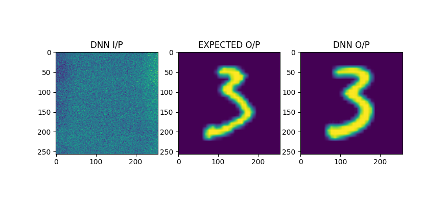

# Research
An autoencoder approach to recover images from noise and blurring

# How to run ?

1. Clone this repo to a local directory and run train.py - all other scripts(except VisualiseResults.py) will be executed as per need by doing this.
2. You will be asked to select a fine-tuning and main-dataset directory in the form of popup menus in order to create and save input-output image pairs to those directories
3. Run VisualiseResults.py after training and prediction is complete - select testing set directory and results will be plotted using random input selection

# Example results

# Dependencies 

Python 3

Tensorflow 2.6

OpenCV

